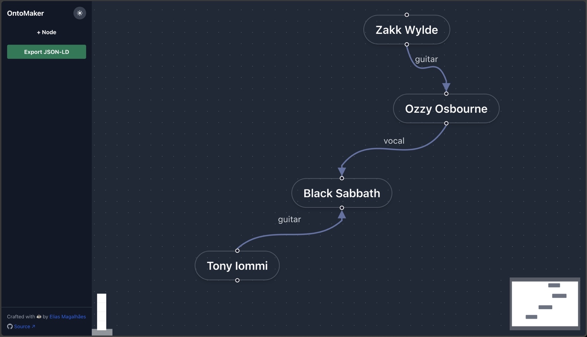

# OntoMaker

**OntoMaker** is a visual tool for building lightweight ontologies and semantic schemas.

---

## 🚀 Features

- 🧩 Add entities (nodes) and relationships (edges) dynamically
- 🖱️ Click and edit any item in a sidebar panel (label, URI, description, properties)
- 🌐 Multilingual support for descriptions and labels (pt-br / en)
- 🔄 Real-time reactivity, no save button needed
- 🧠 Built for thinking: not a full OWL editor, but a rapid modeling surface
- 📤 Export schema as JSON-LD for reuse or integration

---

## 🧪 Use cases

- Designing semantic APIs
- Teaching OWL and RDF logic
- Building data integration schemas
- Visual prototyping of knowledge graphs

---

## 🧰 Tech Stack

- React
- XYFlow
- TailwindCSS
- Local state only (no backend)

---

## 📦 Coming soon

- [x] Edge editing
- [x] Dynamic panels
- [x] Label & URI editing
- [x] Export to JSON-LD
- [ ] Export to OWL/RDF/Turtle
- [ ] Import JSON schema
- [ ] Snap to grid / auto layout

---

## 📥 Contributing

Pull requests, forks and issues are more than welcome.

If you're building something semantic and fast — let's talk.

---

## 📸 Demo & Export Sample

The screenshot above shows the basic interface. You can add nodes, connect them with edges, and edit their properties in the sidebar.

The application allows exporting the created ontology graph into a JSON-LD format. You can see an example of the exported structure here:

[View Sample Export (ontology-export-sample.json)](./ontology-export-sample.json)

---

## 📄 License

MIT © [Elias Magalhães](https://github.com/EliasMPJunior)